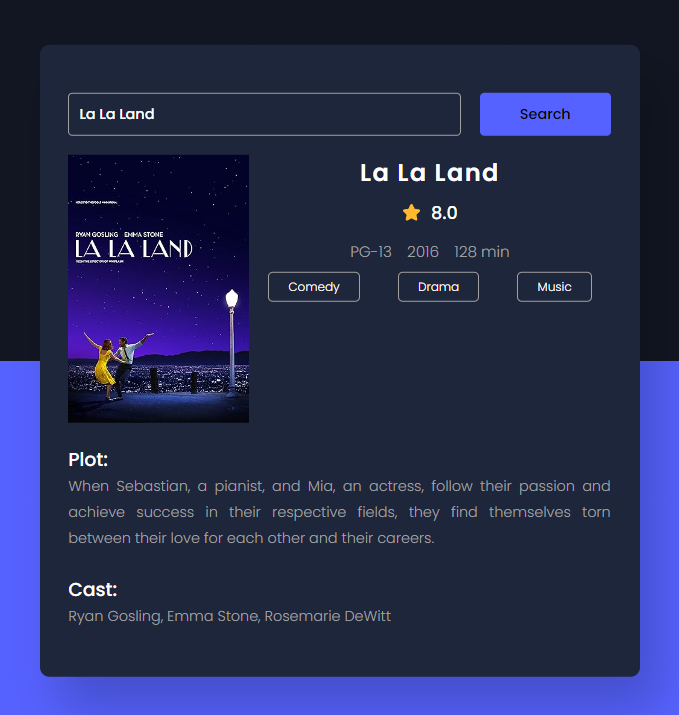

### Movie Info App
The code allows the user to search for movies by name and displays detailed information about the movie, such as the title, poster, IMDB rating, plot, and cast, by fetching data from the OMDB API. If there is an error or invalid input, it shows an error message.

Made with javascript.
tutorial project made by: https://www.youtube.com/@AsmrProg

# Screenshot
Here we have project screenshot :

